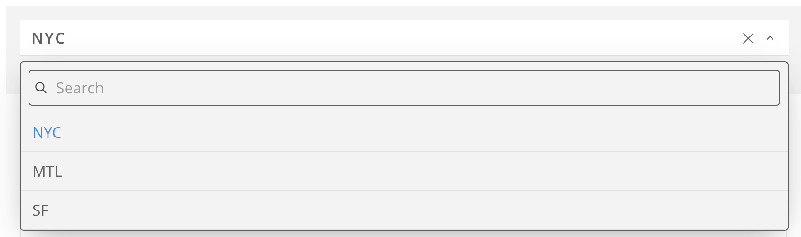
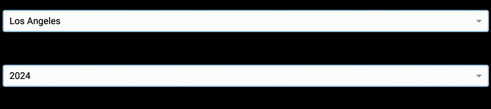

# CHANGELOG

## Version 0.1.1

### June 17, 2026

#### Fixes

- `dash` 4.0 and higher has a [known bug](https://community.plotly.com/t/inconsistent-dropdown-focus-behaviour-in-4-0/96516) where users interacting with searchable `dash.dcc.Dropdown` elements may be forced out after typing a character. As such, this project downgrades to the stable 3.2.0 version of `dash`.
    - An unfortunate consequence is the search property is placed in the dropdown selection itself, as opposed to being its own component in the set of options. Compare the version 4.0 search (picture below) to the 3.2.0 version search (gif below).

#### In-Development

-  *Submeasure dropdown*
    - Purpose: To permit the user greater luxury over the entire breadth of data a specific data table has to offer

- *Data download option*
    - Purpose: to permit end-users/developers to cross-reference the data employed as part of the app