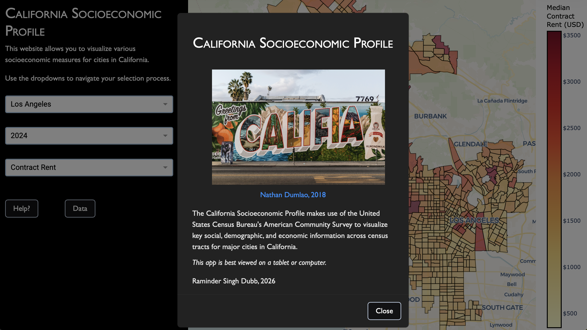

# California Socioeconomic Profile

The **California Socioeconomic Profile** makes use of the United States Census Bureau's American Community Survey to visualize key social, demographic, and economic information across communities in California.

<div align="center">
    
    <p><i>California Socioeconomic Profile (Version 0.1.1)</i></p>
</div>

## Repo Structure
```
├── .github/
│   ├── workflows/
│   │   ├── gcp-deploy.yml
│   │   └── ingest-data.yml         # CI/CD for tracking Census Bureau releases
│   │
│   ├── images/
│   │   └── ...
│   ├── issues/
│   │   └── ...
│   └── CHANGELOG.md
│
├── assets/                         # Styling and JS scripts
│   └── ...
│
├── config/                         # Location of configuration files
│   └── ...
│
├── db_retrieval/                   # Database interfacing (for the Dash app)
│   └── ...
│
├── ingestion/                      # Ingestion interface and metadata specifications
│   └── ...
│
├── page_components/                # Dash app UX/UI components
│   └── ...
│
├── page_figure_styling/            # Choropleth map styling
│   └── ...
│
├── .dockerignore
├── .gitattributes
├── .gitignore
├── app.py                          # App entry-point
├── pipeline.py                     # Data ingestion used by CI/CD workflow (executed every other Tuesday)
├── Dockerfile
├── poetry.lock
├── pyproject.toml
├── requirements.txt
└── README.md
```


## Commentary

**As of June 2026, handling for cloud service deployment (via GCP) was introduced.** The database backend is CloudSQL, and the frontend is containerized and shipped to Artifact Registry (via Docker) and deployed to Cloud Run.

The [current ETL interface](./pipeline.py) merely specifies identifier information for the relevant data tables taken fron the Census Bureau (cf. the [configuration settings](./ingestion/config.py)). It exists as a point of reference for interested developers. Note that, as of May 2026, the Census Bureau requires all API users to supply their own API keys.

Also, no AI.


## Appreciation
Some kinks in parts of the ingestion interface gave some headache, not most of which is the (rewarding) journey that comes with probing the source of the headache. In short order, my much appreciation to the following individuals and the specific contributions they have provided:
- StackOverflow user absoup
    - Issue: `pandas().DataFrame.to_sql()` has certain throughput issues when ingesting in a cloud-hosted relational database service. Thus, it may be beneficial to employ direct translation into textual SQL strings via `sqlalchemy.text`. However, the issues comes with processing NaN values.
    - Resolution: [Regex](https://stackoverflow.com/a/70585493).